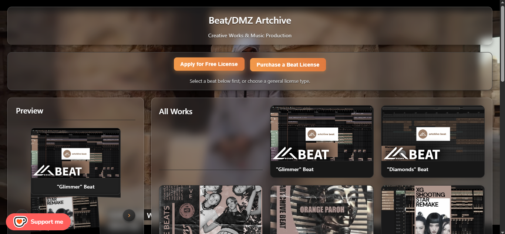

# Static Beat Portfolio & License Generator

A responsive static website template designed to showcase creative works (beats, music, videos) with integrated client-side free license generation and links for purchasing paid licenses via Gumroad. Built purely with HTML, CSS, and Vanilla JavaScript.



## Overview

This project provides a clean, modern interface for artists and producers (like Beat/DMZ Artchive) to display their portfolio. It features:

*   A grid layout showcasing various projects (beats, music videos, EPs).
*   Modal popups for detailed viewing, including embedded players (YouTube, Instagram, Spotify, SoundCloud).
*   A clear distinction between works that are beats (eligible for licensing) and other creative projects.
*   **Client-Side Free License Generation:** Users can apply for a free license for specific beats directly on the site. The system validates input, fills a predefined license template, and generates a downloadable `.txt` license file – all without a backend.
*   **Paid License Integration:** A modal displays different paid license tiers (Standard, Premium, Exclusive) and directs users to a Gumroad link for purchase or provides contact information for exclusive rights.
*   Ko-fi widget integration for support.
*   Responsive design for various screen sizes.
*   Modern dark theme with glassmorphism effects.

## Key Features

*   **Portfolio Display:** Easily showcase your creative work using a grid system.
*   **Multimedia Embeds:** Supports YouTube, Instagram, Spotify, and SoundCloud embeds within modals.
*   **Free License Generator:**
    *   Client-side generation (no server needed).
    *   Form validation for user details and signature.
    *   Generates a downloadable `.txt` file based on a customizable template.
    *   Specific beat title can be pre-filled.
*   **Paid License Workflow:**
    *   Presents multiple license options (Standard, Premium, Exclusive).
    *   Links directly to Gumroad for Standard/Premium purchases.
    *   Provides a `mailto:` link or prompts contact for Exclusive licenses.
    *   Can be initiated for a specific beat or generally.
*   **Customizable:** Easily adapt content, styling, license terms, and purchase links.
*   **Static & Deployable:** Runs entirely in the browser. Deployable on any static hosting platform (GitHub Pages, Netlify, Vercel, etc.).
*   **Responsive:** Adapts layout for desktop, tablet, and mobile devices.

## Technology Stack

*   **HTML5:** Structure and content.
*   **CSS3:** Styling, layout (Grid), responsiveness, animations, and glassmorphism effects (using `backdrop-filter`). Uses CSS Variables for theming.
*   **Vanilla JavaScript (ES6+):** Handles all dynamic behavior:
    *   Modal interactions (open/close).
    *   Fetching data from HTML `data-*` attributes.
    *   Dynamically creating embed iframes.
    *   Form validation and license text generation/download.
    *   Routing purchase options.
*   **Gumroad:** Integrated for handling paid license transactions (via external link).
*   **Ko-fi:** Integrated for optional support/donations.

## Setup & Usage

1.  **Clone or Download:** Get the project files.
    ```bash
    git clone https://github.com/ArtChivegroup/Static-Beat-Portfolio-License-Generator.git
    cd Static-Beat-Portfolio-License-Generator
    ```
2.  **Customize:** Modify the content, styles, and settings (see Customization section below).
3.  **Deploy:** Upload the `index.html`, `style.css`, `script.js`, and the `img/` folder to any static web hosting provider.
    *   **Local Testing:** You can open `index.html` directly in your browser, but some features (like certain embeds or stricter browser security) might work best when served via a local web server (e.g., using VS Code Live Server extension, Python's `http.server`, or `npx serve`).

## Customization

### 1. Content (`index.html`)

*   **Header/Footer:** Update the `<h1>`, `<p class="subtitle">`, and footer copyright year/name.
*   **Portfolio Items:**
    *   Modify the `.grid-item` divs within the `<main class="portfolio-grid">`.
    *   **Crucially, update the `data-*` attributes for each item:**
        *   `data-title`: The main title shown in the modal.
        *   `data-meta`: Secondary details (producer, genre, BPM, etc.).
        *   `data-description`: Text description shown in the modal.
        *   `data-type`: The type of embed (`youtube`, `instagram`, `spotify`, `soundcloud`). Determines how `script.js` creates the embed.
        *   `data-video-id`: YouTube video ID (if `data-type="youtube"`).
        *   `data-embed-url`: Full embed URL (for Spotify, SoundCloud).
        *   `data-height`: Optional height for Spotify/SoundCloud embeds.
        *   `data-link`: The source URL (e.g., YouTube video page, Instagram post).
        *   `data-link-text`: Text for the source link button (e.g., "View on YouTube").
        *   `data-is-beat="true"`: **Add this attribute ONLY to items that are beats** and should show the "Apply Free License" / "Purchase License" buttons in the modal. Omit it or set to `"false"` for other works.
    *   **Images:** Replace images in the `img/` folder and update the `src` attributes in the `` tags. Ensure image `alt` text is descriptive.
*   **Favicons:** Uncomment and replace the placeholder favicon links in the `<head>`.
*   **Background Image:** Replace `img/background.jpg` or change the `background-image` URL in `style.css`.

### 2. Styling (`style.css`)

*   **Theme:** Modify CSS variables in the `:root` block (e.g., `--brand-orange`, `--bg-color-start`) for easy color changes.
*   **Layout/Appearance:** Adjust styles for `.grid-item`, `.modal-content`, buttons, etc., as needed.

### 3. Licensing & Links (`script.js`)

*   **Free License Template:** Modify the `licenseTemplate` variable string to change the terms of the free license. Placeholders `{{BEAT_TITLE}}`, `{{USER_NAME}}`, `{{SIGNATURE}}`, `{{DATE}}` will be replaced dynamically.
*   **Gumroad URL:** Update the `GUMROAD_URL` constant with your specific Gumroad product link (ensure it's set to allow users to specify the price or uses variants if needed).
*   **Exclusive License Contact:** Change the `EXCLUSIVE_CONTACT_EMAIL` constant to your email address used in the `mailto:` link for exclusive inquiries.
*   **Ko-fi:** Update the Ko-fi username `'dmzartchive'` in the Ko-fi script snippet in `index.html`.

### 4. Purchase Options (`index.html`)

*   **License Tiers:** Modify the text, features (`ul.features`), and prices within the `.license-card` divs inside the `purchase-options-modal`.
*   **`onclick="openGumroad('...')"`:** Ensure the arguments (`'standard'`, `'premium'`, `'exclusive'`) match how you want `script.js` to handle the clicks.

## License (Code)

The code for this template is licensed under the MIT License. See the [LICENSE](LICENSE) file for details. (You'll need to create a `LICENSE` file with the standard MIT text).

**Note:** This refers to the license for the *website template code* itself, not the licenses generated *by* the website for the beats.

## Author

Originally created by Moch Dimas Almahtar (Beat/DMZ Artchive).
